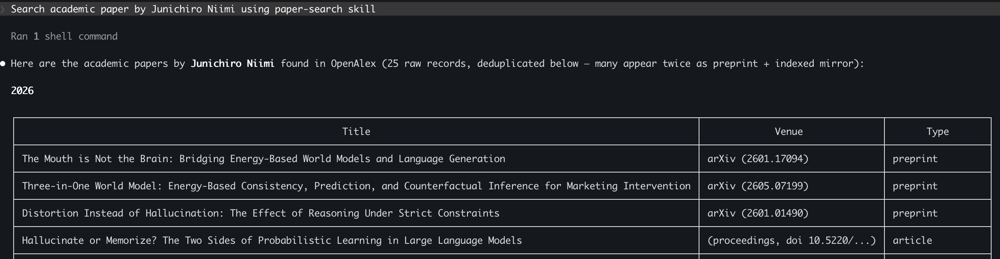
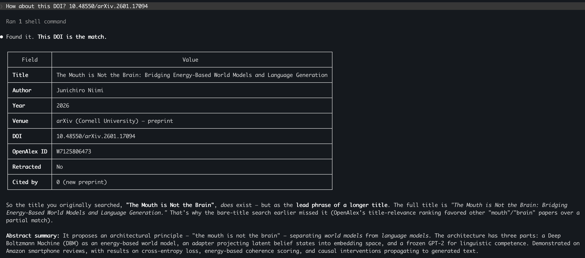

# Claude Code `paper-search` Skill

[](https://doi.org/10.5281/zenodo.20264911)
[](https://arxiv.org/abs/2511.08877)

Search published papers (including preprints) and check whether LLM-generated paper records actually exist.

This skill is built on the free [OpenAlex](http://openalex.org) API. An API key is optional (see [API key](#api-key-optional) below).

## Preparation
### Install the plugin
In Claude Code, register the marketplace and install the plugin:
```
/plugin marketplace add jniimi/claude-skills-marketplace
/plugin install paper-search@jniimi-claude-skills
```
Browse and manage installed plugins with `/plugin`.

Alternatively, load it locally without the marketplace:
```
$ claude --plugin-dir /path/to/paper-search
```
Ask Claude to look up or verify a paper and the `paper-search` skill is
invoked automatically. No `uv` / `pip install` — Python standard library only.

### API key (optional)
OpenAlex works without a key. To use the faster pool, set `OPENALEX_API_KEY`
as an environment variable or in a `.env` file in your working directory.

## Usage
### Search papers by DOI, author, or keyword
Just ask Claude in plain language — for example:
```
Search academic papers by Junichiro Niimi using the paper-search skill
```


### Flexible, conversational queries
```
How about this DOI? 10.48550/arXiv.2601.17094
```


### Arguments (for Claude)
You can ask Claude to apply these options:
- `--abstract`: Include each paper's full abstract in the results. This consumes more tokens, so it is off by default (but Claude often wants to use it anyway :D).
- `--n`: Number of results to return. Default: 5.
- `--sort`: Order of results — `relevance`, `citations` (most cited first), or `date` (newest first). `relevance` requires a keyword search. Default: OpenAlex's own order.
- `--type`: Restrict results to OpenAlex work types, e.g. `article,preprint,book-chapter,review`. Handy for filtering out software, datasets, and other non-paper records. Default: no restriction.

## Use-Cases

### Verifying AI-generated references
LLMs sometimes fabricate citations — yes, it's a real problem (see [Niimi, 2025 — *Hierarchical Memorization in Large Language Models*](https://doi.org/10.48550/arXiv.2511.08877)) — plausible-looking but non-existent papers (so-called "hallucinated references"). With `paper-search` you can instantly cross-check any reference against OpenAlex by DOI or title, catching ghosts before they reach your manuscript.

### Literature discovery through conversation
Ask Claude to find recent papers on a topic, then drill down interactively — filter by author, sort by citation count, pull abstracts, and refine your query in natural language. Useful for exploring an unfamiliar field or catching up on the latest work.

### Writing papers in LaTeX with Claude Code (recommended)
This is where `paper-search` shines most. When you draft or revise a paper in LaTeX inside Claude Code:

- **Build `.bib` entries on the fly** — ask Claude to search for a paper and append a correct BibTeX record to your `.bib` file, complete with DOI and publication year pulled from OpenAlex.
- **Audit an existing `.bib` file** — point Claude at your bibliography and let it walk through each entry, verifying that every cited paper actually exists and that the metadata (title, authors, year, DOI) matches the authoritative record.
- **Catch stale or wrong DOIs** — preprints often get a new DOI once they appear in a journal; a quick DOI lookup reveals mismatches.

Because the skill runs with zero dependencies (Python standard library only), it works anywhere Claude Code runs — no virtual-env setup needed mid-writing-session.

## Citations / Contact
Author: Junichiro Niimi ([@JvckAndersen](https://x.com/JvckAndersen))

If you use this skill, please cite it as:

> Niimi, J. (2026). *paper-search: A Claude Code plugin for academic paper
> search and verification via OpenAlex* [Computer software]. Zenodo.
> https://doi.org/10.5281/zenodo.20264911

```bibtex
@software{niimi2026papersearch,
  author    = {Niimi, Junichiro},
  title     = {paper-search: A Claude Code plugin for academic paper search and verification via OpenAlex},
  year      = {2026},
  publisher = {Zenodo},
  doi       = {10.5281/zenodo.20264911},
  url       = {https://doi.org/10.5281/zenodo.20264911}
}
```

## LICENSE
Released under the [MIT License](LICENSE).